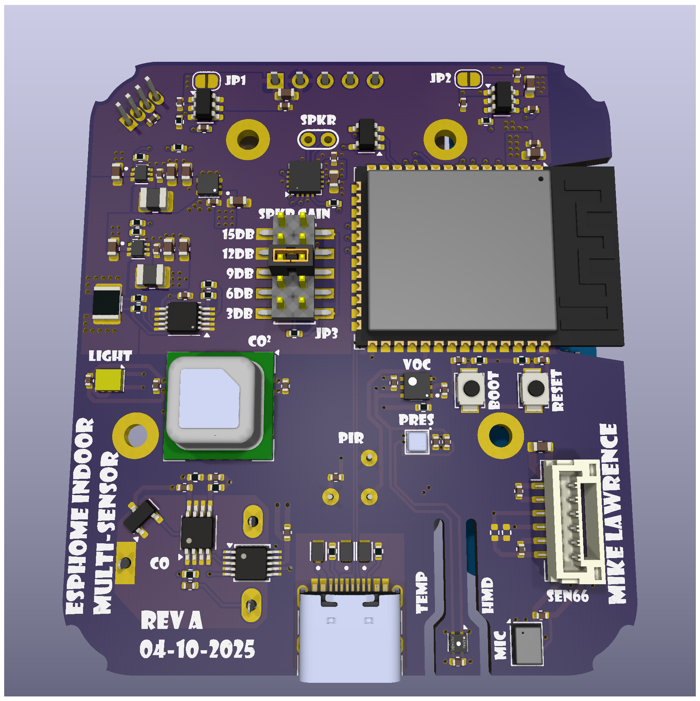
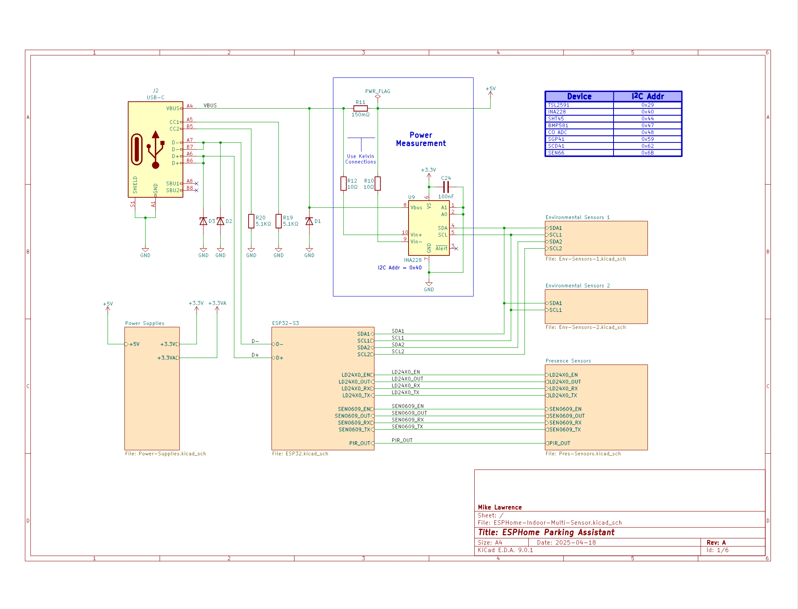

# ESPHome Indoor Multi-Sensor PCB
<p align="center">
     <br />
    3D Render of ESPHome Indoor Multi-Sensor PCB
</p>

The PCB is designed in [KiCad](https://www.kicad.org/). Fabrication and is tuned toward [JCLPCB](https://jlcpcb.com/). The production folder has everything you need for JLCPCB to send you ready to assemble boards. I chose not to use JLCPCB for assembly because they had a hard time with some the parts I chose for this design. When I had the boards fabricated I also had them panelize two PCBs and produce a stencil for both for the panelized boards.

## Schematic
<p align="center">
    <a href="ESPHome-Indoor-Multi-Sensor-Schematic.pdf"></a> <br />
    Schematic
</p>

### Do Not Populate (DNP) Notes
When you use the SEN66 from Sensirion you don't need to install discrete sensor components. ```U11```, ```U12```, ```U16```, ```C29```, ```C29```, ```C30```, ```C31```, ```C43```
* ```C9```, ```C10```, ```R16``` and ```R17```: These components are an optional snubber used to reduce EMI. Not needed.

## Bill of Materials
<p align="center">
    <a href="https://htmlpreview.github.io/?https://github.com/mikelawrence/ESPHome-Indoor-Multi-Sensor/pcb/interactive-bom/index.html"></a> <br />
    Interactive BOM
</p>

## PCB Info
* 4 layer to support an additional ground plane and signal layer to reduce plane interruptions on the outer layers.
* There has been an attempt thermally isolate the SHT4X Temperature and Humidity Sensor but there are no guarantees.
* Dimensions are 52.5mm X 59.7mm.
* Requires oven reflow or hot air to assemble most components.
